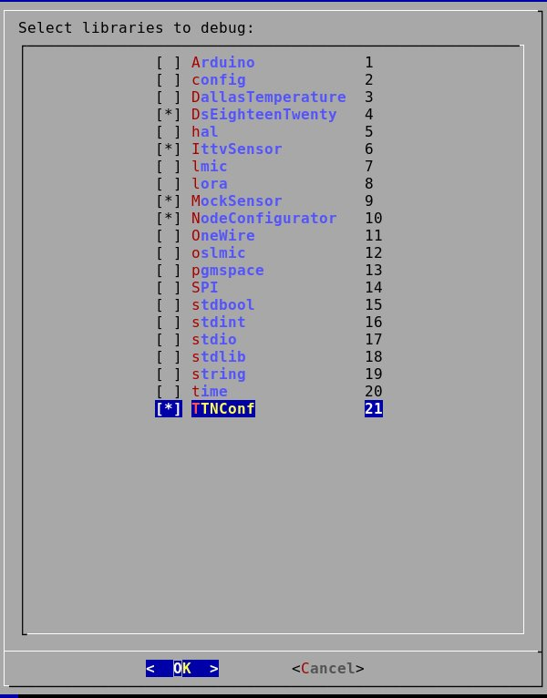

# ArduinoDebugFileCreator
As the Arduino doesn't support debugging of included third-party or self-written libraries, created a simple script that combines library files in one debug.ino.   
   
The script finds included files the project uses and asks from user which of them should be combined together. Combined libraries then needs to be removed from _arduino/libraries_ path while debugging.
   
Usage:   
Give access rights: chmod u+x ./ArduinoDebugFileCreator   
Dialog needs to be installed on your linux.   
`./ArduinoDebugFileCreator program.ino library_dir [outputfile.ino]`   
   
